# AI视频创作平台

一套基于 AI 驱动的全流程视频创作系统，覆盖从小说创作、剧本生成、分镜设计到视频生成的全链路。采用前后端分离架构，后端基于 Spring Boot 3 + LangChain4j，前端基于 Vue 3 + Element Plus，整合 ComfyUI 实现本地 AI 图片和视频生成。

[](LICENSE)
[](https://adoptium.net/)
[](https://vuejs.org/)
[](https://spring.io/projects/spring-boot)

## 视频案例

以下是用本系统全自动创作出的连续短片：

**6 分钟短片**

👉 [点击观看 - Bilibili](https://www.bilibili.com/video/BV1Lh8Z6AEHB/?vd_source=f53e58e282c88f94f9851bd38cd22cde)

**11 分钟短片**

👉 [点击观看 - Bilibili](https://www.bilibili.com/video/BV1fGaa6KEYi/?spm_id_from=333.1387.homepage.video_card.click&vd_source=f53e58e282c88f94f9851bd38cd22cde)

## 使用教程

保姆级视频教程：手把手教你用本系统全自动生成无限时长短剧和 AI 音乐：

👉 [点击观看 - Bilibili](https://www.bilibili.com/video/BV1AM426BEKD/?spm_id_from=333.1387.homepage.video_card.click&vd_source=f53e58e282c88f94f9851bd38cd22cde)

---

## 目录

- [功能特性](#功能特性)
- [系统截图](#系统截图)
- [快速开始](#快速开始)
- [环境要求](#环境要求)
- [ComfyUI 工作流安装（重要）](#comfyui-工作流安装重要)
- [使用指南](#使用指南)
- [技术栈](#技术栈)
- [项目结构](#项目结构)
- [系统更新](#系统更新)
- [常见问题](#常见问题)

---

## 功能特性

### 核心创作流程

```
小说创作 → 剧本生成 → 分镜设计 → 视频生成
  Step0      Step1      Step2      Step3
```

- **小说创作**：输入主题/想法，AI 流式生成小说内容，或直接粘贴已有小说
- **剧本生成**：基于小说 AI 生成结构化剧本（含角色、场景、对白），支持人工编辑修改
- **分镜设计**：AI 生成分镜脚本，支持分镜编辑、首帧图片生成、视频提示词优化
- **视频生成**：批量生成视频片段，支持单个镜头和批量生成

### 资产管理

- **角色资产**：AI 生成角色形象图，支持三视图（正脸、侧面、背面）
- **场景资产**：AI 生成场景背景图，支持多种风格和光照
- **道具资产**：AI 生成道具图片，丰富视频画面细节

### AI 模型支持

- **大语言模型**：阿里百炼（通义千问）、火山引擎（豆包）、DeepSeek、本地 Ollama
- **图片生成**：火山引擎、阿里百炼、ComfyUI（本地）
- **视频生成**：火山引擎、阿里百炼、ComfyUI（本地 LTX / MiniMax H3）

### 辅助工具

- **语音克隆**：VoxCPM2 多角色语音克隆，为视频角色配音
- **音乐创作**：AI 音乐生成，支持提示词/歌词生成背景音乐
- **宫格图像分割**：将全景图/四视图自动分割为独立图片
- **图像编辑**：支持参考图引导的 AI 图像编辑

---

## 系统截图

### 系统设置

配置 AI 大模型、图片生成、视频生成等供应商的 API 密钥和参数。

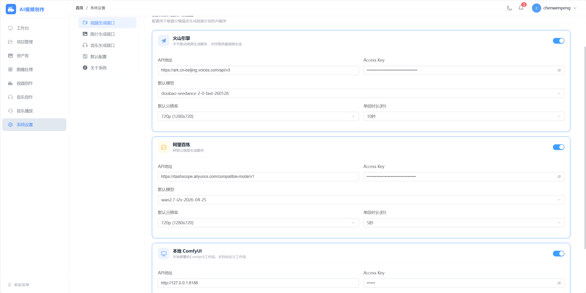

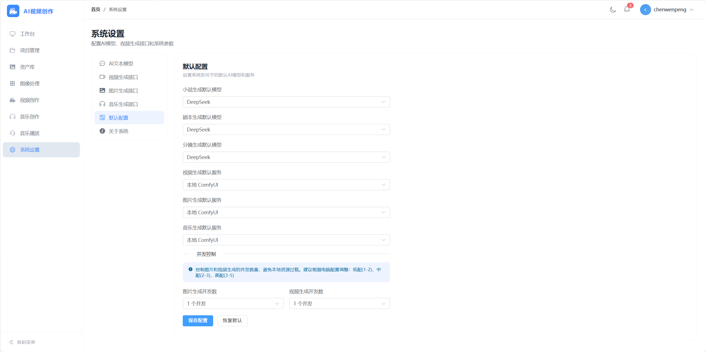

### 项目创建

创建项目，设置项目名称、题材、视觉风格、画面尺寸等。

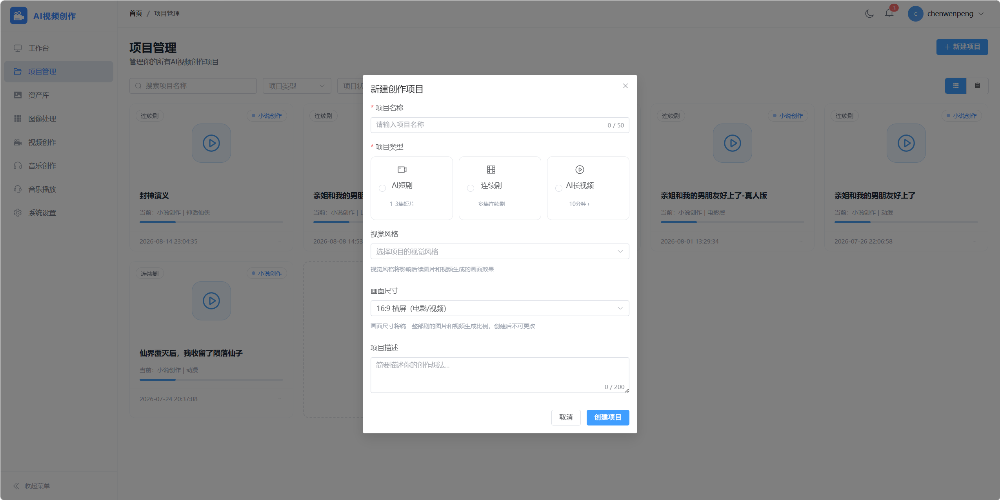

### 小说创作

输入主题或直接粘贴小说内容，AI 辅助生成。

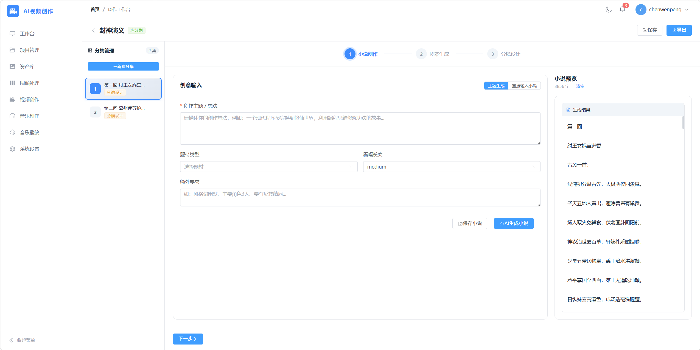

### 剧本生成

AI 异步生成结构化剧本，包含角色信息、场景描述、对白内容，支持人工编辑。

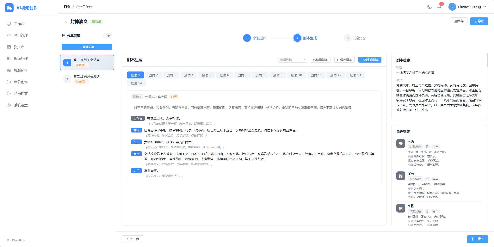

### 资产图片生成

为角色、场景、道具生成 AI 图片，建立资产库保证视频一致性。

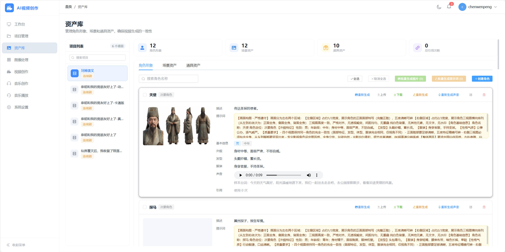

### 分镜设计

AI 生成分镜脚本，支持首帧图片生成、视频提示词优化、批量生成。

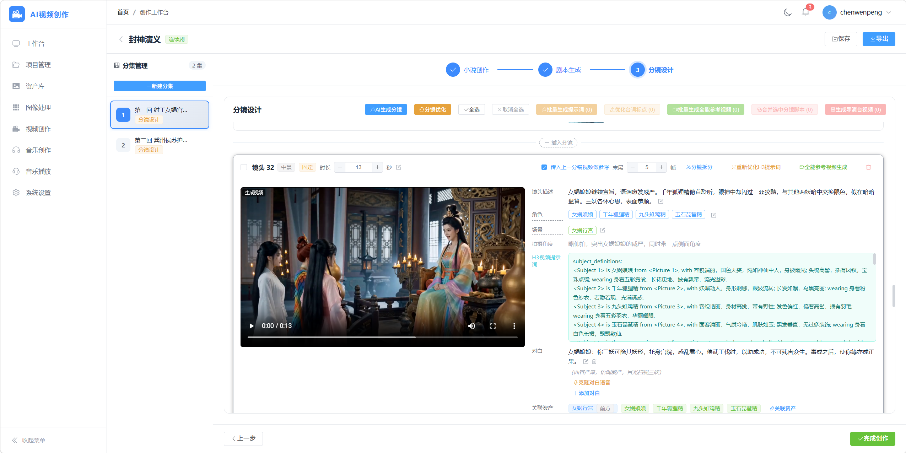

### 音乐创作

AI 生成背景音乐，支持文本提示词和歌词输入。

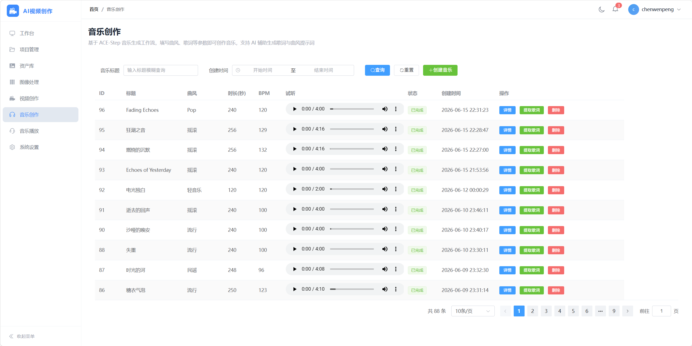

### 在线听歌

内置音乐播放器，在线试听生成的音乐。

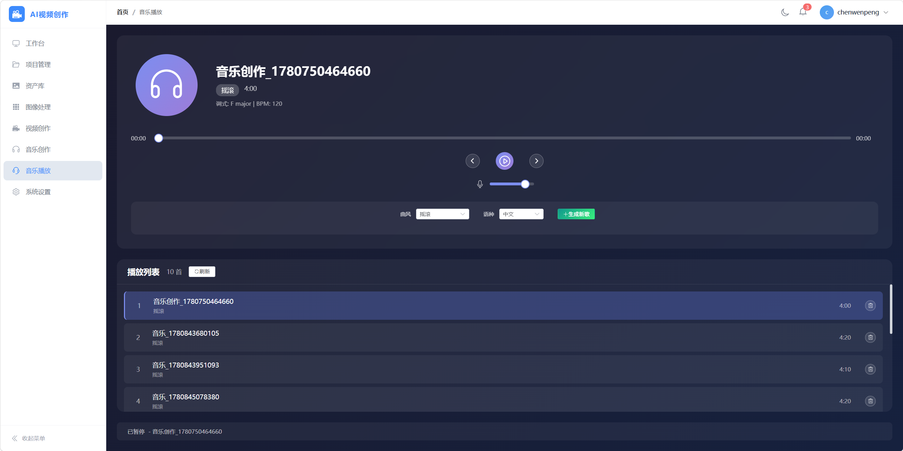

### 宫格图像分割

将生成的多宫格分镜图片自动分割为独立图片，并且高清放大。

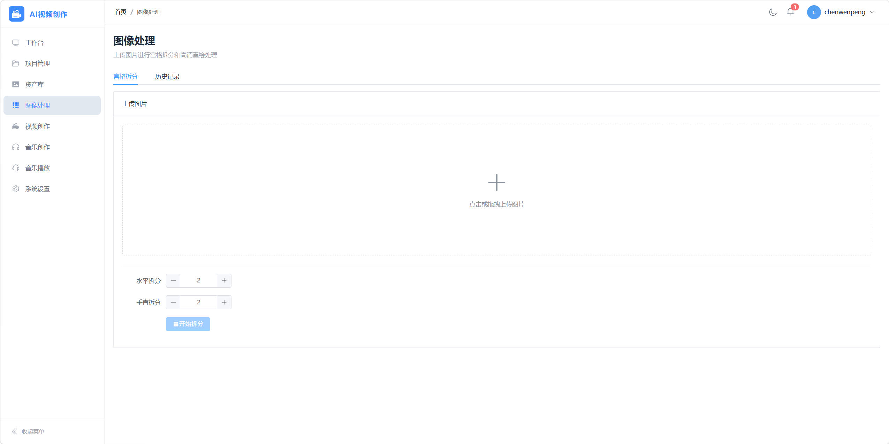

### LTX2.3导演台视频生成

LTX2.3视频生成，首帧、导演台模式。

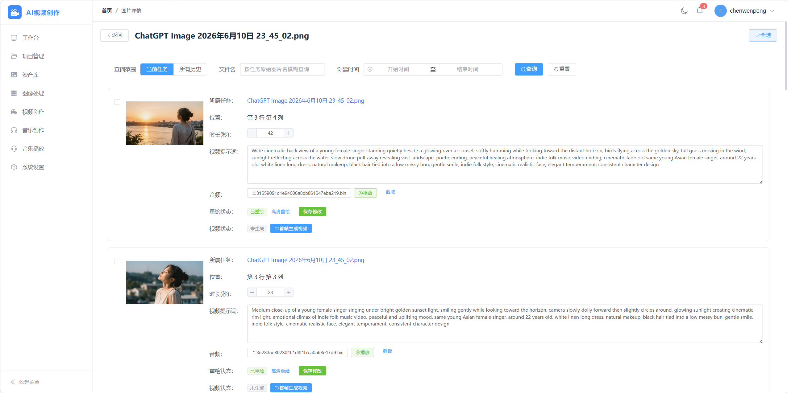

---

## 快速开始

### 下载便携安装包

前往 [Releases](https://github.com/cwp-cwp/ai-video/releases) 页面下载最新版本的便携安装包 `apache-tomcat-10.1.59.zip`。

### 安装步骤

1. **解压** `apache-tomcat-10.1.59.zip` 到任意目录（路径不要包含中文和空格）
2. **双击运行** `start.bat`，等待服务启动完成
3. 浏览器自动打开 `http://localhost:18080`，注册账号即可使用

> 便携安装包已内置 JDK 17、MySQL 8.0、Tomcat 10，无需额外安装任何环境。

---

## 环境要求

| 组件 | 最低要求 | 推荐配置 |
|------|---------|---------|
| 操作系统 | Windows 10/11 64 位 | Windows 11 64 位 |
| 内存 | 16 GB | 32 GB |
| 显卡 | NVIDIA GTX 1060 6GB | NVIDIA RTX 3060 12GB+ |
| 硬盘 | 20 GB 可用空间 | 50 GB SSD |

---

## ComfyUI 工作流安装（重要）

> **本系统依赖 ComfyUI 实现本地图片和视频生成，请务必在启动系统前完成 ComfyUI 的安装和工作流配置。**

### 1. 安装 ComfyUI

请参考 [ComfyUI 官方仓库](https://github.com/comfyanonymous/ComfyUI) 完成安装。

**推荐安装方式**（Windows 便携版）：

```bash
# 下载 ComfyUI_windows_portable 并解压
# 下载地址：https://github.com/comfyanonymous/ComfyUI/releases
```

### 2. 导入工作流

将本仓库 `comfyui工作流/` 目录下的 JSON 文件拖入 ComfyUI 界面即可加载。

**插件和模型不需要提前安装。** 导入工作流后，遇到以下情况再按需处理：

- **节点报红**：说明缺少对应的自定义节点。点击报红节点可查看缺失的节点名称，打开 ComfyUI Manager 搜索并安装该节点包
- **模型缺失**：工作流中的模型加载节点会提示缺少的模型名称，根据节点报错信息下载对应模型文件，放入 ComfyUI 的 `models` 对应子目录

> **⚠️ 导演台节点特别说明**：由于导演台节点原作者频繁更新，本系统中的导演台工作流未能及时同步，使用原版节点可能存在不兼容问题。安装导演台节点时，**请务必使用我 fork 的版本**，不要从原版仓库安装：
>
> 👉 [https://github.com/cwp-cwp/ComfyUI_MiniMaxH3_Director](https://github.com/cwp-cwp/ComfyUI_MiniMaxH3_Director)
>
> 安装步骤：
>
> ```bash
> cd ComfyUI/custom_nodes
> git clone https://github.com/cwp-cwp/ComfyUI_MiniMaxH3_Director.git
> pip install -r ComfyUI_MiniMaxH3_Director/requirements.txt
> ```

> **无需让所有工作流都跑通。** 请根据你要使用的功能，对照下面的分组自行决定需要验证哪些工作流——只验证必选项和自己用得到的可选项即可。

#### 分组 1：资产图生成（必选）✅

生成角色、场景、道具资产图片的核心工作流，使用系统前必须确保运行成功。

| 文件 | 用途 |
|------|------|
| `文生图-image_krea2_turbo_t2i.json` | 图片生成（Krea2 Turbo） |
| `360全景图生成.json` | 360 全景图生成 |
| `360全景图生成全景视频.json` | 全景图转视频 |
| `360全景图预览.json` | 全景图预览 |
| `360全景视频截取多张图.json` | 全景视频截图 |

#### 分组 2：人物台词音色统一（可选）

为视频角色克隆统一音色的配音，不需要配音功能可跳过。

| 文件 | 用途 |
|------|------|
| `VoxCPM2-语音克隆.json` | 语音克隆 |
| `VoxCPM2-语音生成.json` | 语音生成 |

#### 分组 3：视频生成（必选）✅

系统默认的视频生成工作流，使用前必须确保运行成功。

| 文件 | 用途 |
|------|------|
| `video_minimax_h3_r2v.json` | MiniMax H3 视频生成 |
| `video_minimax_h3_r2v_导演台多段衔接.json` | H3 导演台多段衔接 |

#### 分组 4：九宫格分镜图拆分 → LTX 生成视频（可选）

一般用于九宫格分镜图拆分成独立镜头，再使用 LTX-2.3 导演台生成视频。走 H3 视频生成路线的用户可跳过，看需求选择。

| 文件 | 用途 |
|------|------|
| `宫格图像切分.json` | 宫格图像分割 |
| `F2K-高清重绘.json` | 高清重绘 |
| `F2K_高清重绘_可调整宽高.json` | 高清重绘（可调尺寸） |
| `视频-LTX-2.3-首帧-低显存版.json` | 视频生成（首帧模式，低显存） |
| `LTX导演台无字幕.json` | 导演台视频生成 |

#### 分组 5：音乐生成相关（可选）

AI 音乐创作、人声伴奏分离、语音转文字，看个人需求选择。

| 文件 | 用途 |
|------|------|
| `音乐生成_audio_ace_step_1_5_split.json` | AI 音乐生成 |
| `音乐生成（提速版）_audio_ace_step_1_5_split.json` | AI 音乐生成（提速版） |
| `人声伴奏分离.json` | 人声/伴奏分离 |
| `语音文字提取-Qwen3-ASR.json` | 语音转文字 |

#### 其他备用工作流

以下为备用的替换方案或辅助工具，非必需，用到时再验证即可。

| 文件 | 用途 |
|------|------|
| `文生图_qwen_image_2512_with_2steps_lora.json` | 资产图片生成（Qwen-Image 备选） |
| `图像编辑_qwen_Image_edit_subgraphed.json` | 首帧图片生成（支持参考图） |
| `图像编辑-krea2_image_edit.json` | 首帧图片生成（Krea2） |
| `视频-LTX-2.3-首尾帧-量化版.json` | 视频生成（首尾帧模式） |
| `LTX-2.3_MSR_多图参考视频生成.json` | 多图参考视频生成 V1 |
| `LTX-2.3_MSR_多图参考视频生成_V2.json` | 多图参考视频生成 V2 |
| `LTX-2.3-MSR-V2-8G显存版本.json` | 多图参考视频（8G 显存优化） |
| `文生图_image_ideogram4.json` | 图片生成（Ideogram4） |
| `文生图-Qwen-Image-GGUF-Q4KS-4步极速生图.json` | 极速生图模式 |
| `image_z_image_turbo.json` | 图生图 Turbo |
| `VoxCPM2-多人对话语音克隆.json` | 多人对话语音克隆 |
| `音频时长截取.json` | 音频时长截取 |

### 3. 配置 ComfyUI 连接

启动系统后，进入 **系统设置 → 图片生成/视频生成** 页面，将 ComfyUI 的 API 地址填入对应配置项：

- ComfyUI 默认地址：`http://127.0.0.1:8188`
- 确保 ComfyUI 启动时添加了 `--enable-cors-header` 参数，允许跨域访问

---

## 使用指南

### 注册与登录

1. 打开 `http://localhost:18080`，点击"注册"
2. 输入邮箱和密码完成注册
3. 登录后进入工作台

### 创作流程

1. **新建项目**：点击"新建项目"，输入项目名称、描述、题材、视觉风格
2. **小说创作**：输入主题或直接粘贴小说内容，AI 辅助生成
3. **剧本生成**：选择风格后 AI 自动生成结构化剧本，可在编辑模式下修改
4. **资产管理**：为剧本中的角色、场景生成 AI 图片，建立资产库
5. **分镜设计**：AI 生成分镜脚本，优化提示词，生成首帧图片
6. **视频生成**：批量生成视频片段，预览并导出

### 模型配置

进入 **系统设置** 页面，配置以下内容：

- **AI 模型**：选择大语言模型供应商（阿里百炼/火山引擎/DeepSeek/Ollama），填入 API Key
- **图片生成**：选择图片生成供应商（火山引擎/阿里百炼/ComfyUI），配置 API 地址
- **视频生成**：选择视频生成供应商，配置 API 地址
- **默认配置**：设置各步骤默认使用的模型供应商

---

> ⚠️ **文本模型建议使用 DeepSeek**，其他模型（阿里百炼、火山引擎等）在结构化输出方面不够稳定，可能出现剧本格式错误、分镜生成异常等问题。

> ⚠️ **图片和视频生成建议使用 ComfyUI**，其他厂商的模型未经过充分测试，适配度不高，可能出现生成失败或效果不佳的问题。

## License

MIT License